# iMaliChat Accounting System - Definitive Reference

> **Version**: 1.0
> **Last Updated**: February 2026
> **Scope**: Complete double-entry bookkeeping ledger system for the iMali token economy
> **Source of Truth**: `functions/src/ledger/` (TypeScript, Firebase Cloud Functions)

---

## Table of Contents

1. [System Overview](#1-system-overview)
2. [Core Principles](#2-core-principles)
3. [Chart of Accounts](#3-chart-of-accounts)
4. [Account Hierarchy & Sub-Accounts](#4-account-hierarchy--sub-accounts)
5. [Journal System](#5-journal-system)
6. [Token Flows - Double-Entry Ledger](#6-token-flows---double-entry-ledger)
7. [Escrow Reservation System](#7-escrow-reservation-system)
8. [Group Accounts (Stokvels)](#8-group-accounts-stokvels)
9. [Administrative Operations](#9-administrative-operations)
10. [Reconciliation & Integrity](#10-reconciliation--integrity)
11. [Configuration Constants](#11-configuration-constants)
12. [Firestore Data Model](#12-firestore-data-model)
13. [Error Handling](#13-error-handling)
14. [Appendix: Complete Journal Type Reference](#appendix-complete-journal-type-reference)

---

## 1. System Overview

The iMaliChat accounting system is a **double-entry bookkeeping trust ledger** built on Firebase Firestore. Every token movement in the platform — earning, spending, transferring, cashing out — is recorded as a balanced journal entry where total debits always equal total credits.

### High-Level Architecture

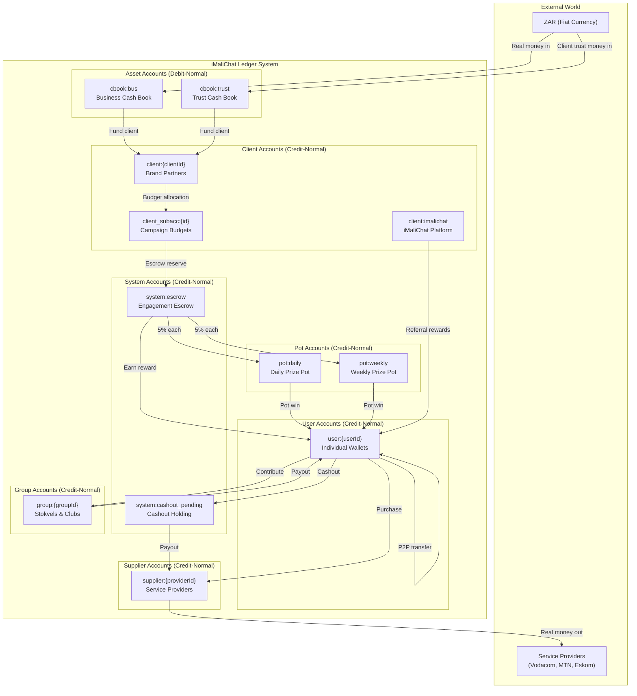

### Token Lifecycle Summary

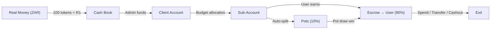

---

## 2. Core Principles

### 2.1 Double-Entry Rule

Every journal entry must be **balanced**: the sum of all debits must equal the sum of all credits. The `postJournal()` function enforces this atomically — a journal that doesn't balance is rejected before any account is modified.

### 2.2 Debit-Normal vs Credit-Normal

| Account Type | Normal Balance | Debit Effect | Credit Effect |
|---|---|---|---|
| `cbook` (Cash Book) | **Debit-Normal** | Increases balance | Decreases balance |
| All other types | **Credit-Normal** | Decreases balance | Increases balance |

This follows traditional accounting: asset accounts (cash books representing real money held) are debit-normal; liability/equity accounts (user balances, client deposits) are credit-normal.

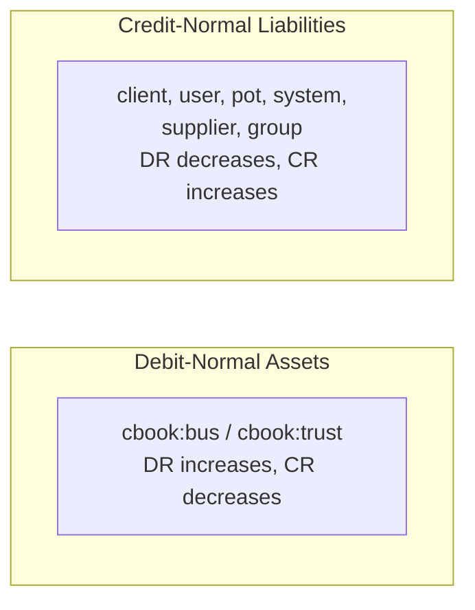

### 2.3 Immutability

Journal entries are **immutable** once posted. Corrections are made by posting a **reversal journal** — a new journal with opposite entries. The original journal is marked `status: "reversed"` and linked to the reversal via `reversalJournalId`.

### 2.4 Idempotency

Every journal has a unique `idempotencyKey`. If a retry attempts to post a journal with an existing key, the system returns the existing journal with `isDuplicate: true` instead of creating a duplicate. This makes all operations safe for network retries.

### 2.5 Atomicity

All balance updates happen inside Firestore `runTransaction()` calls. Either all account balances are updated and the journal is created, or nothing changes. There is no intermediate state.

### 2.6 Non-Negativity

The ledger prevents any credit-normal account from going below zero. When a journal would cause a balance to become negative, it returns `INSUFFICIENT_BALANCE` and the entire transaction is rolled back.

---

## 3. Chart of Accounts

### 3.1 Account Types

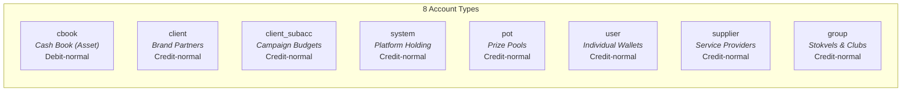

| Type | ID Format | Normal Balance | Purpose | Creation |
|---|---|---|---|---|
| `cbook` | `cbook:bus`, `cbook:trust` | Debit | Represent real ZAR held. Business cash book and external client trust. | System init |
| `client` | `client:{clientId}` | Credit | Brand partner master accounts. Hold funded tokens before allocation. | Admin creates via `adminCreateClient` |
| `client_subacc` | `client_subacc:{subAccountId}` | Credit | On-ledger budget allocations within a client. Campaign-specific. | Admin creates via `adminCreateClientSubAccount` |
| `system` | `system:cashout_pending`, `system:escrow` | Credit | Platform holding accounts for in-flight operations. | System init |
| `pot` | `pot:daily`, `pot:weekly` | Credit | Prize pool accumulators. Receive 5% of each earning. | System init |
| `user` | `user:{userId}` | Credit | Individual user token balance. Has sub-accounts for UI "wallets". | Auto-created on first interaction |
| `supplier` | `supplier:{providerId}` | Credit | Service provider accounts (airtime, electricity, EFT cashout). | Auto-created on first transaction |
| `group` | `group:{groupId}` | Credit | Stokvel/club pooled funds. | Created via `getOrCreateGroupAccount` |

### 3.2 System Accounts (Well-Known)

These 7 accounts are created by `initializeSystemAccounts()` during platform setup:

| Account ID | Type | Purpose |
|---|---|---|
| `cbook:bus` | `cbook` | **Business Cash Book** — Represents iMaliChat's own funds. Debited when admin funds a client from business funds. Asset account. |
| `cbook:trust` | `cbook` | **Trust Cash Book** — Represents external client funds held in trust. Debited when admin funds a client from trust money. Asset account. |
| `pot:daily` | `pot` | **Daily Pot** — Accumulates 5% of every user earning. Drawn daily, winnings go to a random eligible user. |
| `pot:weekly` | `pot` | **Weekly Pot** — Accumulates 5% of every user earning. Drawn weekly, larger prize pool. |
| `system:cashout_pending` | `system` | **Cashout Pending** — Temporary holding for tokens during cashout processing. Debited from user, held here until payment provider confirms. |
| `system:escrow` | `system` | **Engagement Escrow** — Holds reserved tokens during active engagements. Guarantees payout on completion. |
| `client:imalichat` | `client` | **iMaliChat Platform Client** — iMali's own client account. Source for referral rewards and platform-funded incentives. |

### 3.3 Account ID Convention

All account IDs follow the pattern `{type}:{identifier}`:

```
cbook:bus              → Cash Book, business
cbook:trust            → Cash Book, trust
pot:daily              → Daily pot
pot:weekly             → Weekly pot
system:cashout_pending → Cashout holding
system:escrow          → Engagement escrow
client:imalichat       → iMaliChat's own client account
client:abc123          → Brand partner with ID abc123
client_subacc:xyz789   → Client sub-account with ID xyz789
user:uid_001           → User with Firebase UID uid_001
supplier:vodacom       → Supplier Vodacom
group:stokvel_42       → Group (stokvel) with ID stokvel_42
```

The `AccountId` helper provides builders and parsers:

```
AccountId.user("uid_001")              → "user:uid_001"
AccountId.client("abc123")             → "client:abc123"
AccountId.clientSubAccount("xyz789")   → "client_subacc:xyz789"
AccountId.isDebitNormal("cbook:bus")   → true
AccountId.isDebitNormal("user:uid_001")→ false
AccountId.parseUserId("user:uid_001")  → "uid_001"
```

---

## 4. Account Hierarchy & Sub-Accounts

### 4.1 Two-Layer User Balances

The ledger maintains **two layers** of balance tracking for users:

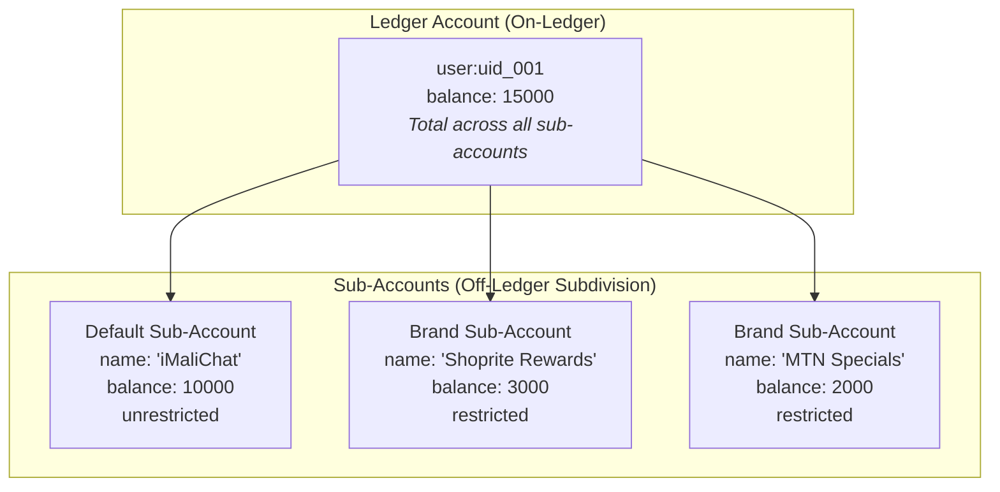

**Layer 1 — Ledger Account** (`ledgerAccounts/{userId}`): The on-ledger balance used in double-entry journals. `postJournal()` debits/credits this account.

**Layer 2 — Sub-Accounts** (`ledgerAccounts/{userId}/subAccounts/{subAccountId}`): UI-level subdivisions displayed as "wallets" in the app. These track which brand's tokens the user holds. Sub-account balances must always sum to the parent ledger account balance.

### 4.2 Sub-Account Types

| Property | Default Sub-Account | Brand Sub-Account |
|---|---|---|
| `accountTypeId` | `null` | References a `SubAccountTypeDefinition` |
| `isDefault` | `true` | `false` |
| `name` | "iMaliChat" | Brand name (e.g., "Shoprite Rewards") |
| Restrictions | None — can spend anywhere, cashout freely | Governed by `AccountTypeRules` |

### 4.3 Account Type Rules

Brand sub-accounts can be restricted by `AccountTypeRules`:

```typescript
interface AccountTypeRules {
  allowedOperations: string[];    // ["purchase", "transfer", "cashout"]
  restrictedSuppliers?: string[]; // Only spend at these suppliers
  allowCashout: boolean;          // Can tokens be cashed out?
  allowP2PTransfer: boolean;      // Can tokens be sent to other users?
  minPurchaseAmount?: number;     // Minimum spend per transaction
  maxPurchaseAmount?: number;     // Maximum spend per transaction
}
```

### 4.4 Sub-Account Operations

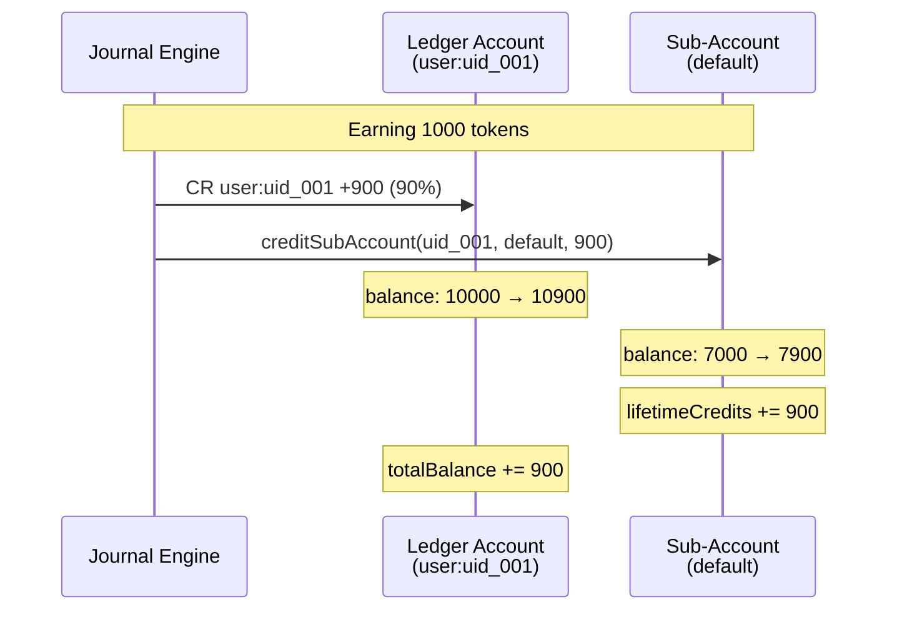

Key operations:
- **`creditSubAccount(userId, subAccountId, amount)`** — Atomic increment of sub-account balance, lifetimeCredits, and parent totalBalance
- **`debitSubAccount(userId, subAccountId, amount)`** — Atomic decrement with balance validation
- **`transferBetweenSubAccounts(userId, fromId, toId, amount)`** — Atomic debit + credit in a single transaction
- **`validateSubAccountAllows(subAccount, operation)`** — Checks operation permissions against account type rules

---

## 5. Journal System

### 5.1 Journal Structure

Every token movement is recorded as a `LedgerJournal` document in the `ledgerJournals` collection:

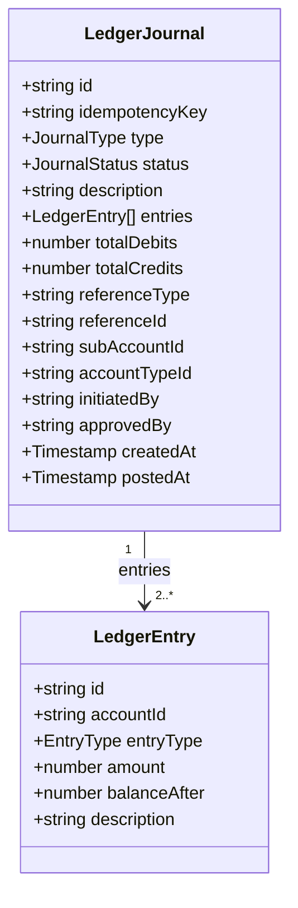

### 5.2 Journal Types (Complete List)

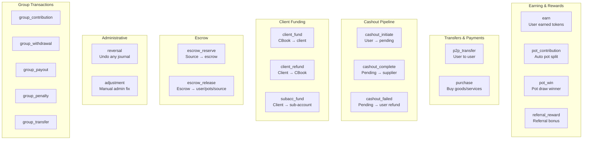

| Journal Type | Entries | Source → Destination | Trigger |
|---|---|---|---|
| `earn` | 4 entries | source → user (90%) + daily pot (5%) + weekly pot (5%) | Engagement completion |
| `pot_contribution` | 2 entries | source → pot | Part of earning (legacy) |
| `pot_win` | 2 entries | pot → user | Daily/weekly pot draw |
| `purchase` | 2 entries | user → supplier | User buys airtime/electricity |
| `referral_reward` | 3 entries | client:imalichat → referrer + referee | New user referral |
| `p2p_transfer` | 2 entries | user → user | Peer-to-peer send |
| `cashout_initiate` | 2 entries | user → system:cashout_pending | User requests cashout |
| `cashout_complete` | 2 entries | system:cashout_pending → supplier | Payment confirmed |
| `cashout_failed` | 2 entries | system:cashout_pending → user | Payment failed, refund |
| `client_fund` | 2 entries | cbook → client | Admin funds brand |
| `client_refund` | 2 entries | client → cbook | Admin refunds brand |
| `subacc_fund` | 2 entries | client → client_subacc | Budget allocation |
| `escrow_reserve` | 2 entries | source → system:escrow | Engagement started |
| `escrow_release` | 4-5 entries | system:escrow → user + pots + source(excess) | Engagement completed |
| `reversal` | N entries | Opposite of original | Admin or system correction |
| `adjustment` | 2+ entries | Varies | Manual admin fix |
| `group_contribution` | 2 entries | user → group | Member pays into stokvel |
| `group_withdrawal` | 2 entries | group → user | Member withdraws |
| `group_payout` | 2 entries | group → user | Scheduled rotation payout |
| `group_penalty` | 2 entries | user → group | Late/missed contribution |
| `group_transfer` | 2 entries | group → external | Group-level transfer |

### 5.3 Journal Status Lifecycle

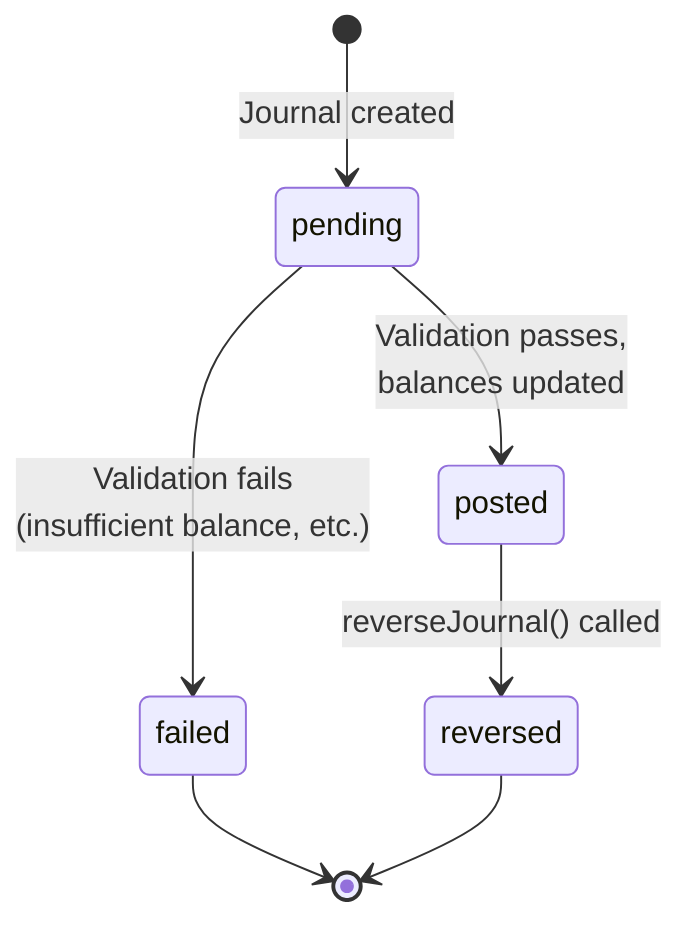

### 5.4 Idempotency Key Patterns

Every operation has a deterministic idempotency key to prevent duplicates:

| Operation | Key Pattern | Example |
|---|---|---|
| Earning | `earn:{engagementId}` | `earn:eng_abc123` |
| Pot contribution | `pot_contrib:{engagementId}` | `pot_contrib:eng_abc123` |
| Pot win | `pot_win:{potDrawId}:{userId}` | `pot_win:draw_001:uid_001` |
| Purchase | `purchase:{purchaseId}` | `purchase:pur_xyz` |
| Referral | `referral:{referralId}` | `referral:ref_456` |
| P2P transfer | `p2p:{transferId}` | `p2p:tfr_789` |
| Cashout initiate | `cashout_init:{cashoutId}` | `cashout_init:co_111` |
| Cashout complete | `cashout_complete:{cashoutId}` | `cashout_complete:co_111` |
| Cashout failed | `cashout_failed:{cashoutId}` | `cashout_failed:co_111` |
| Client fund | `client_fund:{clientId}:{reference}` | `client_fund:brand_01:ref_001` |
| Client refund | `client_refund:{clientId}:{reference}` | `client_refund:brand_01:ref_002` |
| Sub-account fund | `subacc_fund:{subAccountId}:{reference}` | `subacc_fund:sa_01:ref_003` |
| Escrow reserve | `escrow_reserve:{engagementId}` | `escrow_reserve:eng_abc123` |
| Escrow release | `escrow_release:{engagementId}` | `escrow_release:eng_abc123` |
| Reversal | `reversal:{originalJournalId}` | `reversal:jnl_original_001` |
| Adjustment | `adjustment:{adjustmentId}` | `adjustment:adj_001` |
| Group contribution | `group_contrib:{groupId}:{txId}` | `group_contrib:stk_01:tx_001` |
| Group withdrawal | `group_withdraw:{groupId}:{txId}` | `group_withdraw:stk_01:tx_002` |
| Group payout | `group_payout:{groupId}:{txId}` | `group_payout:stk_01:tx_003` |
| Group penalty | `group_penalty:{groupId}:{memberId}:{date}` | `group_penalty:stk_01:uid_001:2026-02-08` |

---

## 6. Token Flows - Double-Entry Ledger

### 6.1 Flow 1: Client Funding (Real Money → Tokens)

Admin deposits real money and credits a client's account.

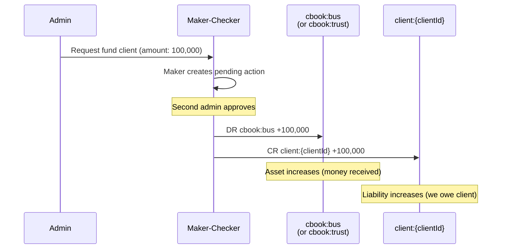

**Journal**: `client_fund`
**Entries**:

| # | Account | Entry | Amount | Effect |
|---|---|---|---|---|
| 1 | `cbook:bus` | DEBIT | 100,000 | Balance increases (debit-normal asset) |
| 2 | `client:{clientId}` | CREDIT | 100,000 | Balance increases (credit-normal) |

### 6.2 Flow 2: Sub-Account Budget Allocation

Client tokens are allocated to campaign-specific sub-accounts.

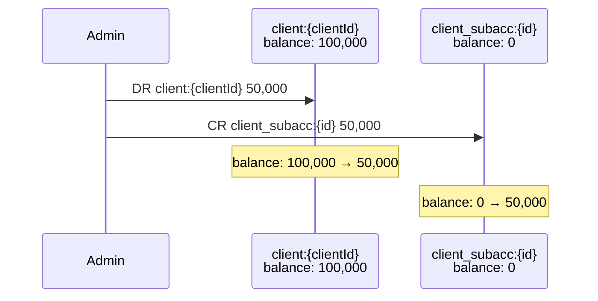

**Journal**: `subacc_fund`
**Entries**:

| # | Account | Entry | Amount |
|---|---|---|---|
| 1 | `client:{clientId}` | DEBIT | 50,000 |
| 2 | `client_subacc:{id}` | CREDIT | 50,000 |

### 6.3 Flow 3: Earning with Escrow (Primary Earn Path)

The full engagement lifecycle with escrow reservation, 90/5/5 split, and optional bonus.

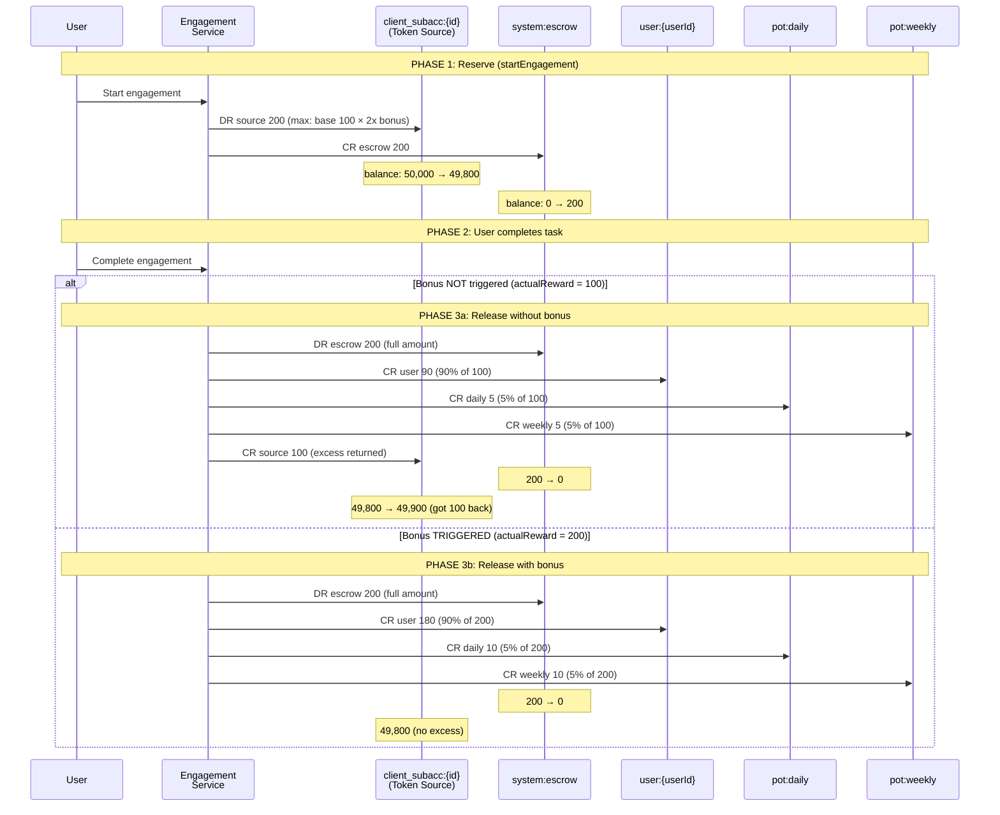

**Phase 1 Journal**: `escrow_reserve`

| # | Account | Entry | Amount |
|---|---|---|---|
| 1 | `client_subacc:{id}` (source) | DEBIT | 200 |
| 2 | `system:escrow` | CREDIT | 200 |

**Phase 3a Journal (no bonus)**: `escrow_release`

| # | Account | Entry | Amount | Description |
|---|---|---|---|---|
| 1 | `system:escrow` | DEBIT | 200 | Full escrow released |
| 2 | `user:{userId}` | CREDIT | 90 | User earning (90%) |
| 3 | `pot:daily` | CREDIT | 5 | Daily pot (5%) |
| 4 | `pot:weekly` | CREDIT | 5 | Weekly pot (5%) |
| 5 | `client_subacc:{id}` | CREDIT | 100 | Excess returned to source |

**Proof**: DR 200 = CR 90 + 5 + 5 + 100 = 200. Balanced.

**Phase 3b Journal (bonus triggered)**: `escrow_release`

| # | Account | Entry | Amount | Description |
|---|---|---|---|---|
| 1 | `system:escrow` | DEBIT | 200 | Full escrow released |
| 2 | `user:{userId}` | CREDIT | 180 | User earning (90%) |
| 3 | `pot:daily` | CREDIT | 10 | Daily pot (5%) |
| 4 | `pot:weekly` | CREDIT | 10 | Weekly pot (5%) |

**Proof**: DR 200 = CR 180 + 10 + 10 = 200. Balanced. No excess entry.

### 6.4 Flow 4: Earning without Escrow (Legacy Path)

For in-flight engagements that started before escrow was deployed. Uses `processEarningWithSplit()`.

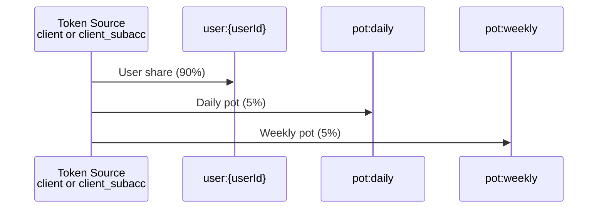

**Journal**: `earn`
**Entries** (for 1000 token reward):

| # | Account | Entry | Amount |
|---|---|---|---|
| 1 | Source account | DEBIT | 1000 |
| 2 | `user:{userId}` | CREDIT | 900 |
| 3 | `pot:daily` | CREDIT | 50 |
| 4 | `pot:weekly` | CREDIT | 50 |

### 6.5 Flow 5: Escrow Abandonment / Timeout

When a user abandons an engagement or escrow times out (2 hours).

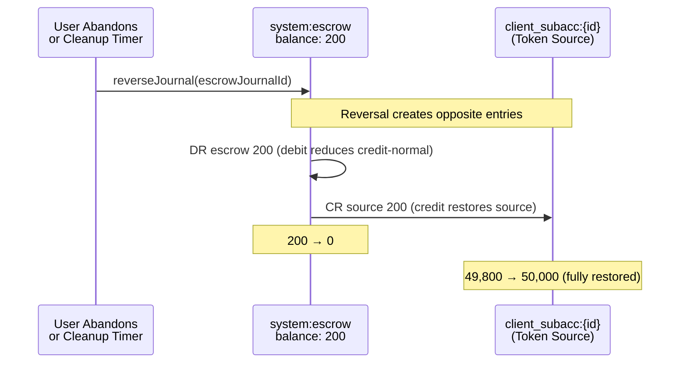

**Journal**: `reversal` (reverses the original `escrow_reserve`)

| # | Account | Entry | Amount |
|---|---|---|---|
| 1 | `system:escrow` | DEBIT | 200 |
| 2 | `client_subacc:{id}` | CREDIT | 200 |

### 6.6 Flow 6: Pot Win

User wins a daily or weekly pot draw.

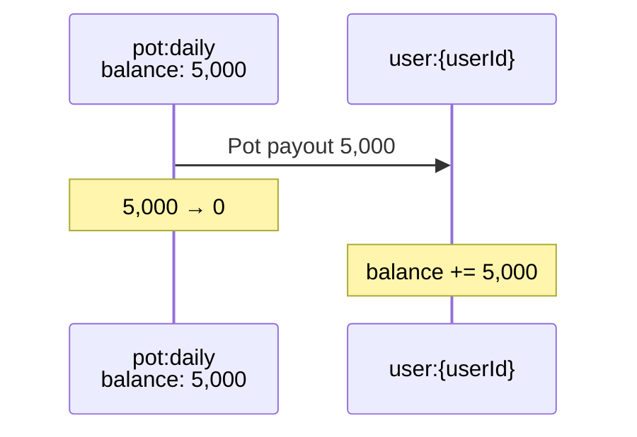

**Journal**: `pot_win`

| # | Account | Entry | Amount |
|---|---|---|---|
| 1 | `pot:daily` (or `pot:weekly`) | DEBIT | 5,000 |
| 2 | `user:{userId}` | CREDIT | 5,000 |

### 6.7 Flow 7: Referral Rewards

When a new user signs up via referral link, both parties receive tokens from iMaliChat's own client account.

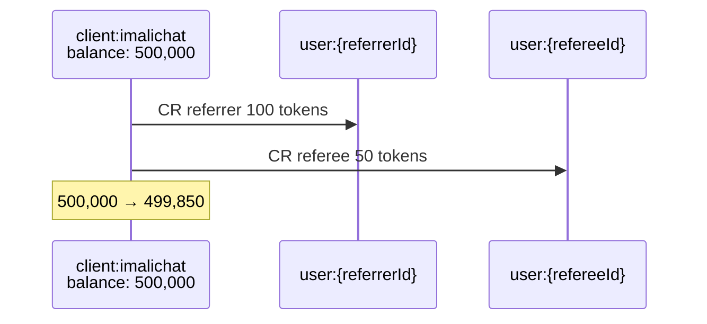

**Journal**: `referral_reward`

| # | Account | Entry | Amount |
|---|---|---|---|
| 1 | `client:imalichat` | DEBIT | 150 |
| 2 | `user:{referrerId}` | CREDIT | 100 |
| 3 | `user:{refereeId}` | CREDIT | 50 |

### 6.8 Flow 8: P2P Transfer

Direct token transfer between users.

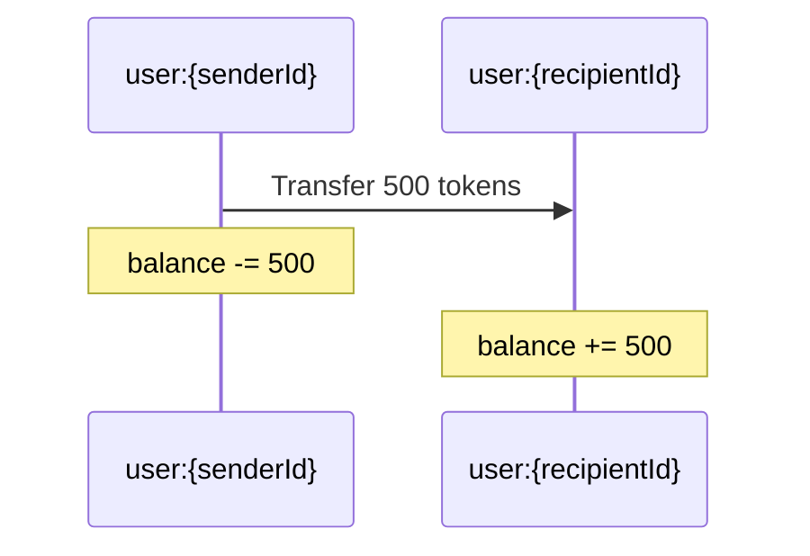

**Journal**: `p2p_transfer`

| # | Account | Entry | Amount |
|---|---|---|---|
| 1 | `user:{senderId}` | DEBIT | 500 |
| 2 | `user:{recipientId}` | CREDIT | 500 |

Both users' sub-accounts are also updated (sender debited, recipient credited).

### 6.9 Flow 9: Purchase (Airtime, Electricity, etc.)

User buys goods/services from a supplier.

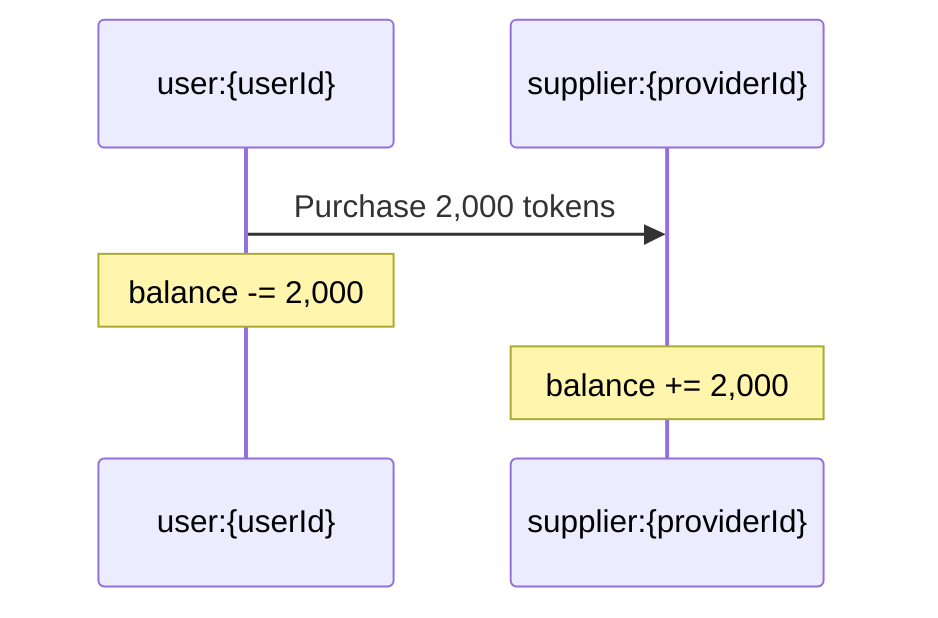

**Journal**: `purchase`

| # | Account | Entry | Amount |
|---|---|---|---|
| 1 | `user:{userId}` | DEBIT | 2,000 |
| 2 | `supplier:{providerId}` | CREDIT | 2,000 |

### 6.10 Flow 10: Cashout (3-Phase Pipeline)

Converting tokens back to real money (ZAR) is a three-phase process:

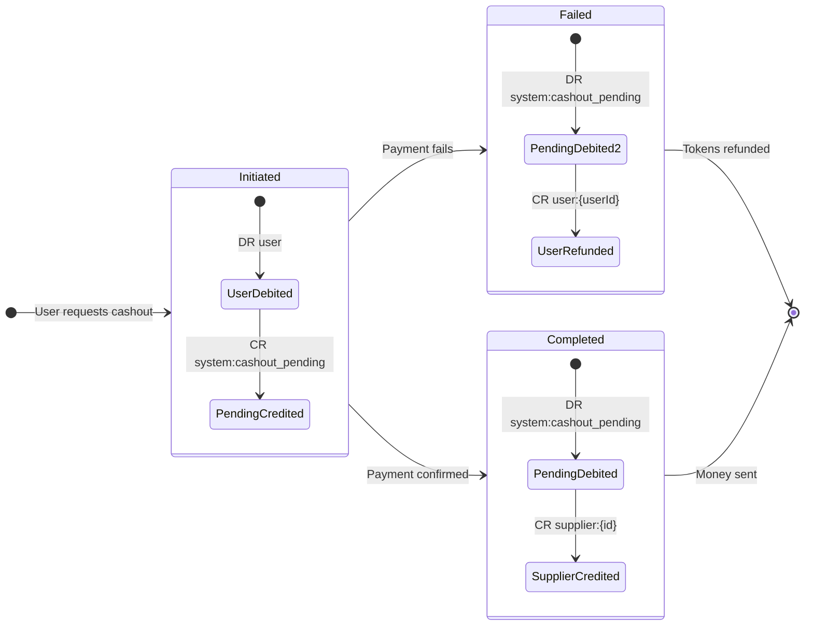

**Phase 1 — Initiate** (`cashout_initiate`):

| # | Account | Entry | Amount |
|---|---|---|---|
| 1 | `user:{userId}` | DEBIT | 5,000 |
| 2 | `system:cashout_pending` | CREDIT | 5,000 |

**Phase 2a — Complete** (`cashout_complete`):

| # | Account | Entry | Amount |
|---|---|---|---|
| 1 | `system:cashout_pending` | DEBIT | 5,000 |
| 2 | `supplier:{cashout_eft}` | CREDIT | 5,000 |

**Phase 2b — Fail/Refund** (`cashout_failed`):

| # | Account | Entry | Amount |
|---|---|---|---|
| 1 | `system:cashout_pending` | DEBIT | 5,000 |
| 2 | `user:{userId}` | CREDIT | 5,000 |

### 6.11 Flow 11: Client Refund

Admin refunds a client, returning tokens to the cash book.

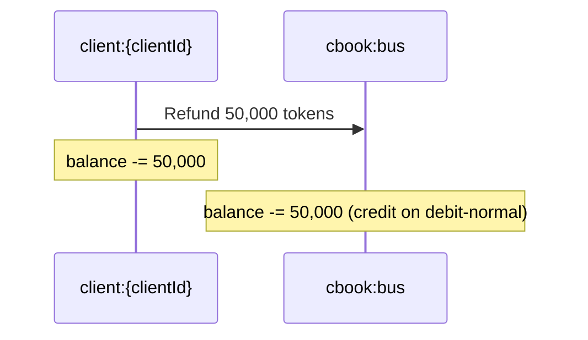

**Journal**: `client_refund`

| # | Account | Entry | Amount |
|---|---|---|---|
| 1 | `client:{clientId}` | DEBIT | 50,000 |
| 2 | `cbook:bus` (or `cbook:trust`) | CREDIT | 50,000 |

### 6.12 Flow 12: Journal Reversal

Any posted journal can be reversed. The reversal creates a new journal with opposite entries.

```mermaid
sequenceDiagram
    participant SYS as System / Admin
    participant ORIG as Original Journal<br/>(status: posted)
    participant REV as Reversal Journal<br/>(new)

    SYS->>ORIG: reverseJournal(journalId)
    Note over ORIG: status → reversed<br/>reversedAt, reversedBy set
    ORIG->>REV: Create with swapped DR/CR
    Note over REV: type: "reversal"<br/>originalJournalId set
    REV->>REV: Apply opposite balance changes
```

---

## 7. Escrow Reservation System

### 7.1 Purpose

The escrow system solves the **concurrent drain problem**: when a user starts an engagement, the campaign budget is checked. But between start and completion (potentially minutes), other users can drain the budget. Without escrow, the completing user gets "Insufficient budget" after doing the work.

Escrow **guarantees** payout by atomically reserving the maximum possible reward at engagement start.

### 7.2 Escrow Lifecycle

```mermaid
flowchart TD
    START["User starts engagement"] --> CALC["Calculate max payout:<br/>baseReward × bonusMultiplier"]
    CALC --> RESERVE["Reserve in escrow<br/>DR source, CR escrow"]
    RESERVE -->|"Insufficient balance"| REJECT["Reject: 'Offer unavailable'"]
    RESERVE -->|"Success"| ACTIVE["Engagement active<br/>Tokens locked in escrow"]

    ACTIVE -->|"User completes"| BONUS{"Bonus<br/>triggered?"}
    BONUS -->|"Yes"| FULLPAY["Release full amount<br/>90/5/5 split<br/>No excess"]
    BONUS -->|"No"| PARTPAY["Release base amount<br/>90/5/5 split<br/>Excess → source"]

    ACTIVE -->|"User abandons"| REVERSE["Reverse escrow<br/>Full amount → source"]
    ACTIVE -->|"2hr timeout"| CLEANUP["Auto-cleanup<br/>Reverse + mark abandoned"]

    FULLPAY --> DONE["Engagement completed"]
    PARTPAY --> DONE
    REVERSE --> ABANDONED["Engagement abandoned"]
    CLEANUP --> ABANDONED
```

### 7.3 Escrow Amount Calculation

```
escrowAmount = floor(baseReward × bonusRewardMultiplier)
```

- If `bonusRewardMultiplier` is 1 (no bonus configured): escrow = base reward
- If `bonusRewardMultiplier` is 2: escrow = 2× base reward (reserves max)

### 7.4 Cleanup Scheduler

The `cleanupAbandonedEscrows` Cloud Function runs every 15 minutes:

1. Calculates cutoff: `now - 2 hours`
2. For each active status (`started`, `watching`, `surveying`, `in_progress`):
   - Queries engagements where `status == X AND createdAt < cutoff`
   - Processes up to 200 per status per run
3. For each stale engagement:
   - If `escrowJournalId` exists and not yet reversed: calls `reverseJournal()`
   - Updates engagement: `status: "abandoned"`, records reversal details
   - If reversal fails: still marks abandoned, sets `escrowReversalFailed: true`

### 7.5 Escrow Configuration

| Parameter | Value | Purpose |
|---|---|---|
| `ESCROW_TTL_MS` | 7,200,000 (2 hours) | Maximum time before auto-cleanup |
| `CLEANUP_INTERVAL_CRON` | `*/15 * * * *` | Cleanup runs every 15 minutes |
| `CLEANUP_BATCH_SIZE` | 200 | Max engagements processed per status per run |

---

## 8. Group Accounts (Stokvels)

### 8.1 Overview

Group accounts support traditional South African savings clubs (stokvels) and other collective financial arrangements.

### 8.2 Group Types

| Type | Description |
|---|---|
| `stokvel` | Traditional rotating savings club |
| `savings` | General savings group |
| `family` | Family financial group |
| `organization` | Organization/business group |
| `club` | Social club |
| `custom` | Custom group type |

### 8.3 Group Roles & Permissions

```mermaid
graph TB
    OWNER["Owner<br/>Full control"] --> ADMIN["Admin<br/>Manage members, approve"]
    ADMIN --> TREASURER["Treasurer<br/>Financial operations"]
    TREASURER --> MEMBER["Member<br/>Contribute, view"]
    MEMBER --> VIEWER["Viewer<br/>Read-only"]
```

### 8.4 Group Token Flows

```mermaid
sequenceDiagram
    participant M as user:{memberId}
    participant G as group:{groupId}

    Note over M,G: Contribution
    M->>G: group_contribution: DR user, CR group

    Note over M,G: Withdrawal
    G->>M: group_withdrawal: DR group, CR user

    Note over M,G: Scheduled Payout (Rotation)
    G->>M: group_payout: DR group, CR user

    Note over M,G: Late Penalty
    M->>G: group_penalty: DR user, CR group
```

### 8.5 Stokvel Settings

For stokvel-type groups, additional settings govern contribution cycles and payout rules:

- **Contribution amount**: Fixed amount per cycle
- **Contribution frequency**: weekly, biweekly, monthly
- **Payout type**: rotating, lottery, equal_split, custom
- **Penalty amount**: Fixed penalty for missed contributions
- **Grace period**: Days after due date before penalty

---

## 9. Administrative Operations

### 9.1 Maker-Checker Pattern

High-value financial operations require two-phase approval:

```mermaid
sequenceDiagram
    participant Maker as Maker<br/>(First Admin)
    participant PA as pendingActions<br/>Collection
    participant Checker as Checker<br/>(Second Admin)
    participant Ledger as Ledger System

    Maker->>PA: Create pending action<br/>(fund, refund, cashout)
    PA->>PA: status: "pending"
    Checker->>PA: Approve action
    PA->>PA: status: "approved"
    PA->>Ledger: Execute financial operation
    Ledger->>Ledger: Post journal
    PA->>PA: status: "completed"

    Note over Maker,Ledger: Maker ≠ Checker (enforced)
```

Operations requiring maker-checker:
- **`adminFundClientAccount`** — Funding a client from cash book
- **`adminRefundClient`** — Refunding a client to cash book
- **`adminCompleteCashout`** — Completing a pending cashout

### 9.2 Client Lifecycle

```mermaid
stateDiagram-v2
    [*] --> Created: adminCreateClient
    Created --> Funded: adminFundClientAccount
    Funded --> SubAllocated: adminCreateClientSubAccount +<br/>adminFundClientSubAccount
    SubAllocated --> Active: Engagements running
    Active --> SoftDeleted: adminSoftDeleteClient

    state SoftDeleted {
        [*] --> RefundSubAccounts: Refund all sub-accounts to client
        RefundSubAccounts --> RefundClient: Refund client to cbook
        RefundClient --> DeactivateThreads: Soft-delete threads
        DeactivateThreads --> DeactivateOpps: Soft-delete opportunities
        DeactivateOpps --> MarkDeleted: isDeleted: true, isActive: false
    }
```

### 9.3 Reconciliation

The `adminRunLedgerRecon` function performs comprehensive integrity checks:

1. **Per-account reconciliation**: Recalculates each account's balance from all its journal entries and compares to stored balance
2. **Journal balance verification**: Ensures every journal has totalDebits == totalCredits
3. **System balance check**: Verifies aggregate system invariants
4. **Drift detection**: Flags accounts where stored balance != calculated balance

```mermaid
flowchart TD
    RECON["Run Reconciliation"] --> ACCOUNTS["For each account"]
    ACCOUNTS --> CALC["Sum all entries:<br/>credits - debits (credit-normal)<br/>debits - credits (debit-normal)"]
    CALC --> COMPARE{"Calculated ==<br/>Stored?"}
    COMPARE -->|"Yes"| PASS["Account reconciled ✓"]
    COMPARE -->|"No"| DRIFT["DRIFT DETECTED ✗<br/>Log discrepancy"]
    DRIFT --> REPAIR["repairAccountBalance()<br/>(manual admin action)"]
```

### 9.4 System Account Status Monitoring

`adminGetSystemAccountStatus` returns real-time balances for all system accounts, enabling the admin dashboard to display:
- Cash book balances (how much real money is represented)
- Client account totals
- Pot balances (how much is in prize pools)
- Escrow balance (how much is currently reserved)
- Cashout pending balance (how much is awaiting payment)

---

## 10. Reconciliation & Integrity

### 10.1 Balance Snapshots

Periodic snapshots are stored in `ledgerSnapshots` for point-in-time reconciliation:

```typescript
interface BalanceSnapshot {
  accountId: string;
  balance: number;
  lastJournalId: string;
  calculatedBalance: number;
  isReconciled: boolean;
  discrepancy: number;        // Should always be 0
}
```

### 10.2 Audit Trail

Every significant ledger event is recorded in `ledgerAudit`:

| Event Type | Trigger |
|---|---|
| `account_created` | New account initialized |
| `account_frozen` | Account frozen by admin |
| `account_unfrozen` | Account unfrozen |
| `account_closed` | Account closed |
| `journal_posted` | Journal successfully posted |
| `journal_reversed` | Journal reversed |
| `journal_failed` | Journal posting failed |
| `reconciliation_passed` | Account reconciliation passed |
| `reconciliation_failed` | Reconciliation found discrepancy |
| `balance_drift_detected` | Stored ≠ calculated balance |
| `manual_adjustment` | Admin made manual adjustment |

### 10.3 Integrity Guarantees

```mermaid
flowchart TB
    subgraph "Guaranteed Invariants"
        I1["Every journal: totalDebits == totalCredits"]
        I2["No credit-normal account goes below 0"]
        I3["Every operation has unique idempotency key"]
        I4["Journal entries are immutable (corrections via reversal)"]
        I5["All balance changes are atomic (Firestore transactions)"]
        I6["Sub-account balances sum to parent ledger balance"]
        I7["Escrow account should drain to 0 (no leaked reservations)"]
    end
```

---

## 11. Configuration Constants

### 11.1 LedgerConfig

| Constant | Value | Description |
|---|---|---|
| `EARNING_USER_SHARE` | 0.90 | 90% of earnings go to user |
| `EARNING_DAILY_POT_SHARE` | 0.05 | 5% to daily pot |
| `EARNING_WEEKLY_POT_SHARE` | 0.05 | 5% to weekly pot |
| `MIN_TRANSFER_AMOUNT` | 1 | Minimum 1 token for any transfer |
| `MIN_CASHOUT_AMOUNT` | 5,000 | Minimum 5,000 tokens (R50) for cashout |
| `DAILY_EARNING_CAP` | 500 | Maximum 500 tokens/day from earnings |
| `DAILY_P2P_LIMIT` | 10,000 | Maximum 10,000 tokens/day P2P |
| `REFERRER_REWARD` | 100 | Referrer receives 100 tokens |
| `REFEREE_REWARD` | 50 | Referee receives 50 tokens |
| `TOKENS_PER_ZAR` | 100 | 100 tokens = R1 ZAR |

### 11.2 EscrowConfig

| Constant | Value | Description |
|---|---|---|
| `ESCROW_TTL_MS` | 7,200,000 | 2-hour escrow timeout |
| `CLEANUP_INTERVAL_CRON` | `*/15 * * * *` | Cleanup every 15 minutes |
| `CLEANUP_BATCH_SIZE` | 200 | Max per status per cleanup run |

### 11.3 Engagement Limits

| Constant | Value | Description |
|---|---|---|
| `DAILY_EARN_CAP` | 30 | Maximum 30 completed engagements per day |

### 11.4 Streak Multipliers

| Day Range | Multiplier | Effect |
|---|---|---|
| Days 1-2 | 1.0x | Base reward |
| Days 3-6 | 1.2x | +20% bonus |
| Days 7-9 | 1.35x | +35% bonus |
| Days 10+ | 1.5x | +50% bonus |

---

## 12. Firestore Data Model

### 12.1 Collection Structure

```mermaid
graph TB
    subgraph "Firestore Collections"
        LA["ledgerAccounts<br/>{accountId}"]
        LJ["ledgerJournals<br/>{journalId}"]
        LS["ledgerSnapshots<br/>{snapshotId}"]
        LAU["ledgerAudit<br/>{auditId}"]

        SA["ledgerAccounts/{userId}/<br/>subAccounts/{subAccountId}"]
        AT["accountTypes<br/>{accountTypeId}"]
    end

    LA -->|"subcollection"| SA
```

### 12.2 Key Document Schemas

**`ledgerAccounts/{id}`**:
```
{
  id: "user:uid_001",
  type: "user",
  name: "User Account",
  ownerId: "uid_001",
  balance: 15000,
  currency: "TOKEN",
  status: "active",
  metadata: {},
  version: 42,
  createdAt, updatedAt
}
```

**`ledgerJournals/{id}`**:
```
{
  id: "jnl_abc123",
  idempotencyKey: "earn:eng_001",
  type: "earn",
  status: "posted",
  description: "Earning: 1000 tokens",
  entries: [
    { id: "e1", accountId: "client_subacc:sa01", entryType: "debit", amount: 1000, balanceAfter: 49000 },
    { id: "e2", accountId: "user:uid_001", entryType: "credit", amount: 900, balanceAfter: 15900 },
    { id: "e3", accountId: "pot:daily", entryType: "credit", amount: 50, balanceAfter: 1050 },
    { id: "e4", accountId: "pot:weekly", entryType: "credit", amount: 50, balanceAfter: 3050 }
  ],
  totalDebits: 1000,
  totalCredits: 1000,
  referenceType: "engagement",
  referenceId: "eng_001",
  initiatedBy: "system",
  createdAt, postedAt
}
```

**`ledgerAccounts/{userId}/subAccounts/{id}`**:
```
{
  id: "sa_default",
  userId: "uid_001",
  accountTypeId: null,
  name: "iMaliChat",
  balance: 12000,
  lifetimeCredits: 50000,
  lifetimeDebits: 38000,
  isActive: true,
  isDefault: true,
  createdAt, updatedAt
}
```

### 12.3 Required Firestore Indexes

| Collection | Fields | Purpose |
|---|---|---|
| `engagements` | `status ASC, createdAt ASC` | Escrow cleanup query |
| `ledgerJournals` | `idempotencyKey ASC` | Idempotency lookup |
| `ledgerJournals` | `referenceType ASC, referenceId ASC` | Find journals by business reference |

---

## 13. Error Handling

### 13.1 Ledger Error Codes

| Code | Meaning | Recovery |
|---|---|---|
| `LEDGER_ACCOUNT_NOT_FOUND` | Account doesn't exist | Create account first |
| `LEDGER_ACCOUNT_FROZEN` | Account is frozen by admin | Admin must unfreeze |
| `LEDGER_ACCOUNT_CLOSED` | Account permanently closed | Cannot reopen |
| `LEDGER_INSUFFICIENT_BALANCE` | Not enough tokens | User needs more tokens |
| `LEDGER_BALANCE_WOULD_GO_NEGATIVE` | Operation would cause negative balance | Same as insufficient |
| `LEDGER_JOURNAL_NOT_BALANCED` | DR ≠ CR (code bug) | Fix entry amounts |
| `LEDGER_JOURNAL_ALREADY_EXISTS` | Idempotency key collision | Return existing (safe) |
| `LEDGER_JOURNAL_ALREADY_REVERSED` | Attempting to reverse a reversal | No action needed |
| `LEDGER_VERSION_CONFLICT` | Concurrent modification | Retry transaction |
| `LEDGER_BALANCE_DRIFT_DETECTED` | Reconciliation found discrepancy | Run `repairAccountBalance` |

### 13.2 Sub-Account Error Codes

| Code | Meaning |
|---|---|
| `SUB_ACCOUNT_NOT_FOUND` | Sub-account doesn't exist |
| `INSUFFICIENT_SUB_ACCOUNT_BALANCE` | Sub-account has too few tokens |
| `OPERATION_NOT_ALLOWED` | Account type rules prohibit this operation |
| `SUPPLIER_NOT_ALLOWED` | Brand sub-account can't spend at this supplier |

---

## Appendix: Complete Journal Type Reference

### Summary Table of All 21 Journal Types

| # | Type | Entries | DR Account(s) | CR Account(s) | Initiated By |
|---|---|---|---|---|---|
| 1 | `earn` | 4 | source | user (90%), daily (5%), weekly (5%) | system |
| 2 | `pot_contribution` | 2 | source | pot | system |
| 3 | `pot_win` | 2 | pot | user | system |
| 4 | `purchase` | 2 | user | supplier | user |
| 5 | `referral_reward` | 3 | client:imalichat | referrer, referee | system |
| 6 | `p2p_transfer` | 2 | sender (user) | recipient (user) | sender |
| 7 | `cashout_initiate` | 2 | user | system:cashout_pending | user |
| 8 | `cashout_complete` | 2 | system:cashout_pending | supplier | system |
| 9 | `cashout_failed` | 2 | system:cashout_pending | user | system |
| 10 | `client_fund` | 2 | cbook | client | admin |
| 11 | `client_refund` | 2 | client | cbook | admin |
| 12 | `subacc_fund` | 2 | client | client_subacc | admin |
| 13 | `escrow_reserve` | 2 | source | system:escrow | system |
| 14 | `escrow_release` | 4-5 | system:escrow | user, daily, weekly, [source excess] | system |
| 15 | `reversal` | N | Opposite of original | Opposite of original | system/admin |
| 16 | `adjustment` | 2+ | Varies | Varies | admin |
| 17 | `group_contribution` | 2 | user | group | user |
| 18 | `group_withdrawal` | 2 | group | user | user/admin |
| 19 | `group_payout` | 2 | group | user | system |
| 20 | `group_penalty` | 2 | user | group | system |
| 21 | `group_transfer` | 2 | group | external | admin |

### Complete Token Flow Diagram

```mermaid
flowchart TB
    subgraph "Money In"
        ZAR["ZAR (Real Money)"]
    end

    subgraph "Asset Layer"
        CBUS["cbook:bus"]
        CTRUST["cbook:trust"]
    end

    subgraph "Client Layer"
        IMALICLIENT["client:imalichat"]
        CLIENTS["client:{id}"]
        SUBACCS["client_subacc:{id}"]
    end

    subgraph "Holding Layer"
        ESCROW["system:escrow"]
        PENDING["system:cashout_pending"]
    end

    subgraph "Distribution Layer"
        DAILY["pot:daily"]
        WEEKLY["pot:weekly"]
    end

    subgraph "User Layer"
        USERS["user:{id}"]
    end

    subgraph "Exit Layer"
        SUPPLIERS["supplier:{id}"]
        GROUPS["group:{id}"]
    end

    subgraph "Money Out"
        PAYOUT["ZAR Payout"]
    end

    ZAR -->|"1. client_fund"| CBUS
    ZAR -->|"1. client_fund"| CTRUST
    CBUS -->|"1. client_fund"| CLIENTS
    CTRUST -->|"1. client_fund"| CLIENTS
    CLIENTS -->|"2. subacc_fund"| SUBACCS
    SUBACCS -->|"3. escrow_reserve"| ESCROW
    ESCROW -->|"4. escrow_release (90%)"| USERS
    ESCROW -->|"4. escrow_release (5%)"| DAILY
    ESCROW -->|"4. escrow_release (5%)"| WEEKLY
    ESCROW -.->|"excess return"| SUBACCS
    DAILY -->|"5. pot_win"| USERS
    WEEKLY -->|"5. pot_win"| USERS
    IMALICLIENT -->|"6. referral_reward"| USERS
    USERS -->|"7. p2p_transfer"| USERS
    USERS -->|"8. purchase"| SUPPLIERS
    USERS -->|"9. cashout_initiate"| PENDING
    PENDING -->|"10. cashout_complete"| SUPPLIERS
    PENDING -.->|"cashout_failed (refund)"| USERS
    SUPPLIERS -->|"Settlement"| PAYOUT
    USERS -->|"11. group_contribution"| GROUPS
    GROUPS -->|"12. group_payout"| USERS
    CLIENTS -.->|"client_refund"| CBUS
```

---

> **Source Files**: `functions/src/ledger/types.ts`, `accounts.ts`, `journals.ts`, `index.ts`, `subAccounts.ts`, `reconciliation.ts`, `groupAccounts.ts`
> **Related**: `functions/src/engagement.ts`, `functions/src/adminAccounts.ts`, `functions/src/adminAccountsExecutors.ts`, `functions/src/scheduled.ts`
