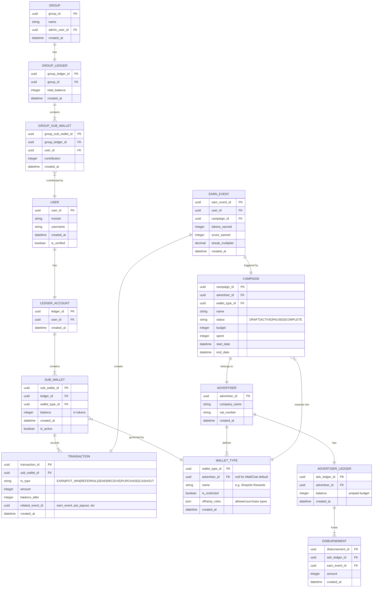
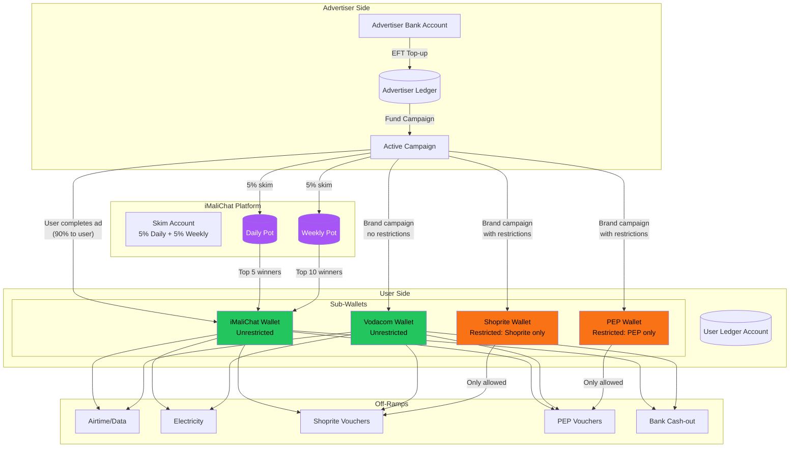
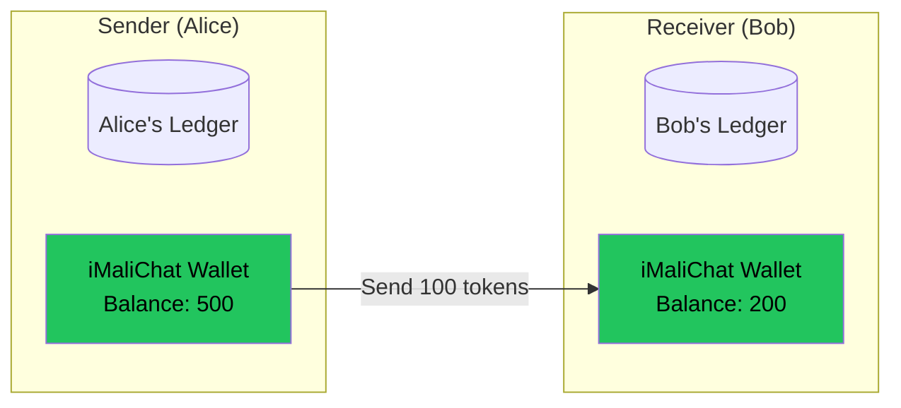
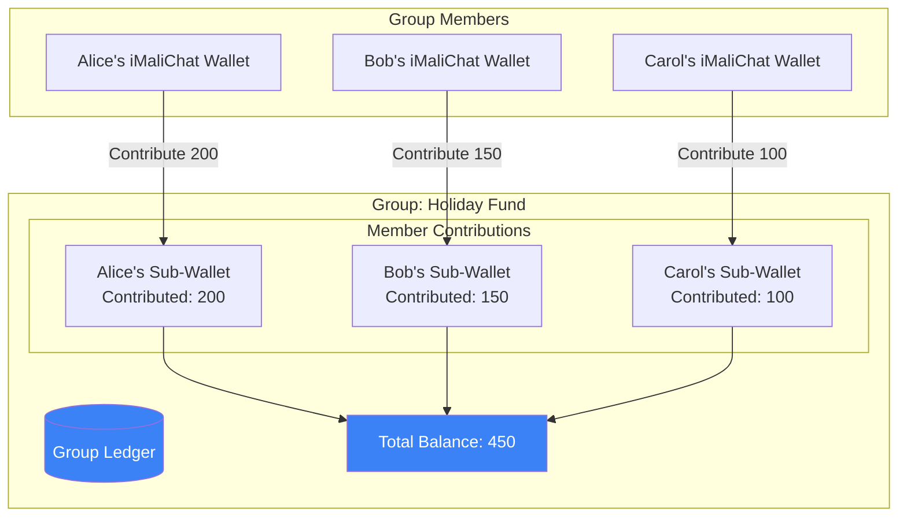
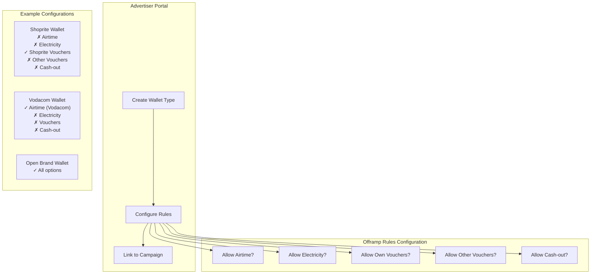

# iMaliChat Wallet Architecture

## Overview

Every user has a single **Ledger Account** containing multiple **Sub-Wallets**. Sub-wallets can be unrestricted (iMaliChat default) or brand-restricted (advertiser-controlled).

---

## Entity Relationship Diagram



---

## Token Flow Diagram



---

## P2P Transfer Flow (Money Chat)



**Rules:**
- P2P transfers only from/to **iMaliChat Wallet** (unrestricted)
- Cannot send from brand-restricted wallets
- Cannot send directly into someone's brand wallet

---

## Future: Group Wallet Flow



**Open Questions:**
- Withdrawal rules (unanimous? admin-only? proportional?)
- Can group wallet earn from campaigns?
- Dissolution rules

---

## Wallet Type Configuration (Advertiser Portal)



---

## Data Model: Sub-Wallet Table

| Field | Type | Description |
|-------|------|-------------|
| `sub_wallet_id` | UUID | Primary key |
| `ledger_id` | UUID | FK to user's ledger account |
| `wallet_type_id` | UUID | FK to wallet type (null = iMaliChat default) |
| `balance` | INTEGER | Current balance in tokens |
| `lifetime_earned` | INTEGER | Total ever credited |
| `lifetime_spent` | INTEGER | Total ever debited |
| `created_at` | DATETIME | When sub-wallet was created |
| `is_active` | BOOLEAN | Can receive/spend |

---

## Data Model: Wallet Type Table

| Field | Type | Description |
|-------|------|-------------|
| `wallet_type_id` | UUID | Primary key |
| `advertiser_id` | UUID | FK to advertiser (null = platform default) |
| `name` | STRING | Display name ("Shoprite Rewards") |
| `description` | STRING | User-facing description |
| `icon_url` | STRING | Brand logo for wallet UI |
| `is_restricted` | BOOLEAN | Has offramp limitations |
| `allowed_offramps` | JSON | `["shoprite_voucher"]` or `["*"]` |
| `allow_p2p_send` | BOOLEAN | Can send via Money Chat |
| `allow_p2p_receive` | BOOLEAN | Can receive via Money Chat |
| `expiry_days` | INTEGER | Days until unused balance expires (null = never) |
| `created_at` | DATETIME | |
| `is_active` | BOOLEAN | Accepting new earnings |

---

## Transaction Routing Logic

```
ON earn_event:
    campaign = get_campaign(earn_event.campaign_id)
    wallet_type = campaign.wallet_type_id
    
    IF wallet_type IS NULL:
        # AdMob/iMaliChat inventory
        target_wallet = user.get_or_create_sub_wallet("imalichat_default")
    ELSE:
        # Brand campaign
        target_wallet = user.get_or_create_sub_wallet(wallet_type)
    
    # Credit user (90%)
    target_wallet.credit(earn_event.tokens_earned)
    
    # Skim to pots (always from platform, not brand wallet)
    daily_pot.credit(earn_event.tokens_earned * 0.05)
    weekly_pot.credit(earn_event.tokens_earned * 0.05)
```

---

## Purchase Validation Logic

```
ON purchase_request(user, sub_wallet, purchase_type):
    wallet_type = sub_wallet.wallet_type
    
    IF wallet_type.is_restricted:
        IF purchase_type NOT IN wallet_type.allowed_offramps:
            REJECT "This wallet can only be used for {allowed_offramps}"
    
    IF sub_wallet.balance < purchase_amount:
        REJECT "Insufficient balance"
    
    APPROVE and debit sub_wallet
```

---

## Open Architectural Questions

| Question | Recommendation |
|----------|----------------|
| Transfer between own sub-wallets? | **No** — defeats brand restriction purpose |
| Pot winnings destination? | **iMaliChat wallet** — platform-level, unrestricted |
| Referral bonus destination? | **iMaliChat wallet** — not brand-specific |
| What if brand discontinues? | Option: convert to unrestricted after N days notice |
| Sub-wallet expiry? | Brand-configurable; notify user before expiry |
| Minimum balance display? | Show all sub-wallets, even zero balance, if active |
